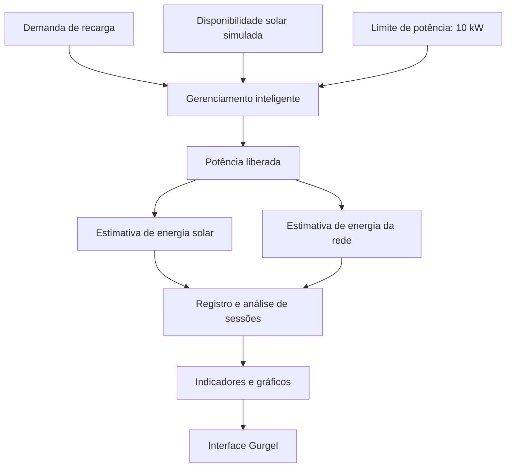
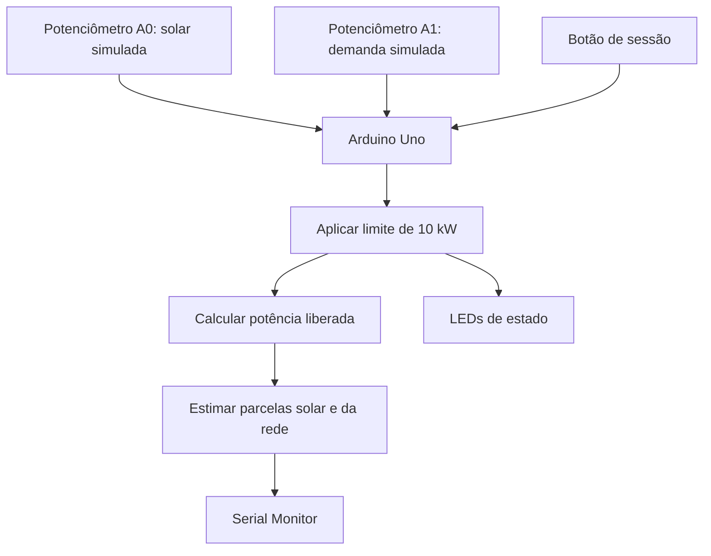
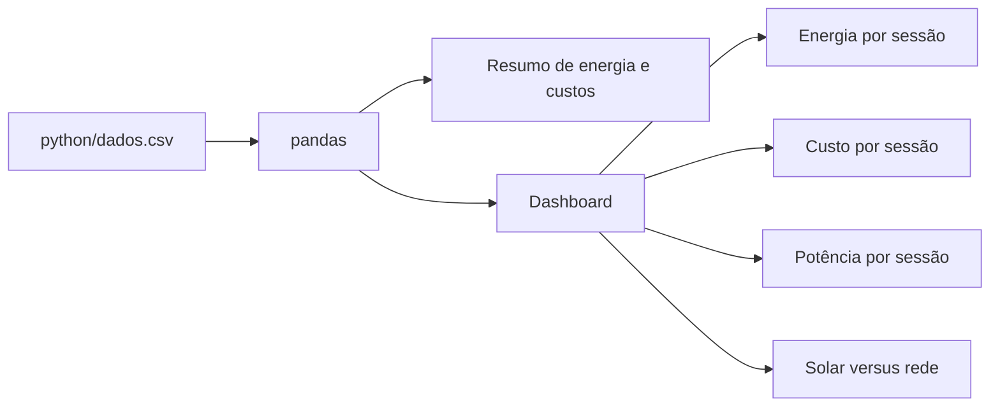

# Diagramas do Gurgel — Sprint 4

## 1. Visão conceitual do sistema

```mermaid
flowchart TD
    A[Demanda de recarga] --> D[Gerenciamento inteligente]
    B[Disponibilidade solar simulada] --> D
    C[Limite de potência: 10 kW] --> D
    D --> E[Potência liberada]
    E --> F[Estimativa de energia solar]
    E --> G[Estimativa de energia da rede]
    F --> H[Registro e análise de sessões]
    G --> H
    H --> I[Indicadores e gráficos]
    I --> J[Interface Gurgel]
```

## 2. Fluxo do protótipo Arduino

```mermaid
flowchart TD
    A[Potenciômetro A0: solar simulada] --> C[Arduino Uno]
    B[Potenciômetro A1: demanda simulada] --> C
    D[Botão de sessão] --> C
    C --> E[Aplicar limite de 10 kW]
    E --> F[Calcular potência liberada]
    F --> G[Estimar parcelas solar e da rede]
    G --> H[Serial Monitor]
    E --> I[LEDs de estado]
```

## 3. Fluxo de análise dos dados

```mermaid
flowchart LR
    A[python/dados.csv] --> B[pandas]
    B --> C[Resumo de energia e custos]
    B --> D[Dashboard]
    D --> E[Energia por sessão]
    D --> F[Custo por sessão]
    D --> G[Potência por sessão]
    D --> H[Solar versus rede]
```
